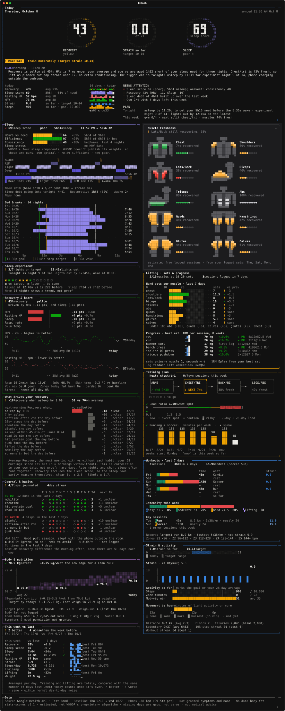
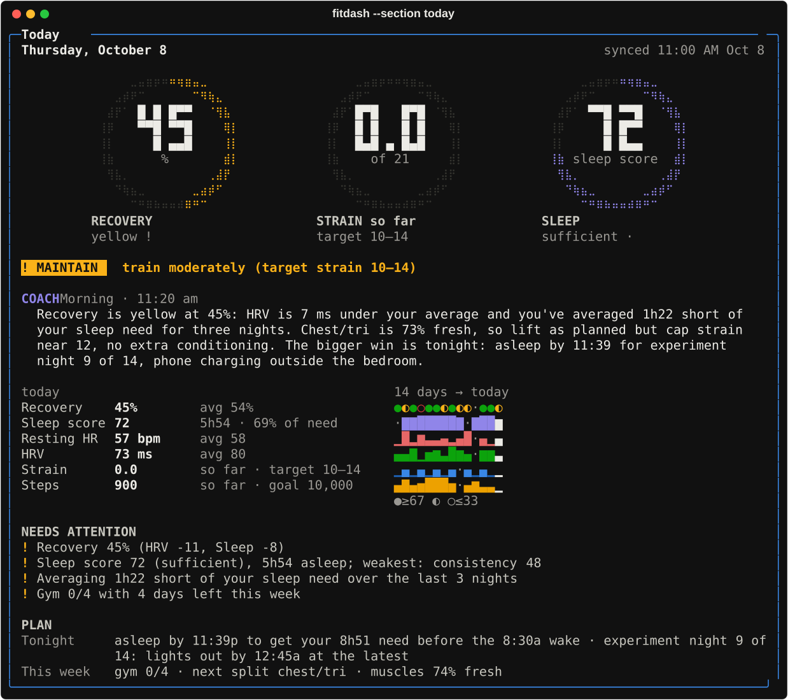
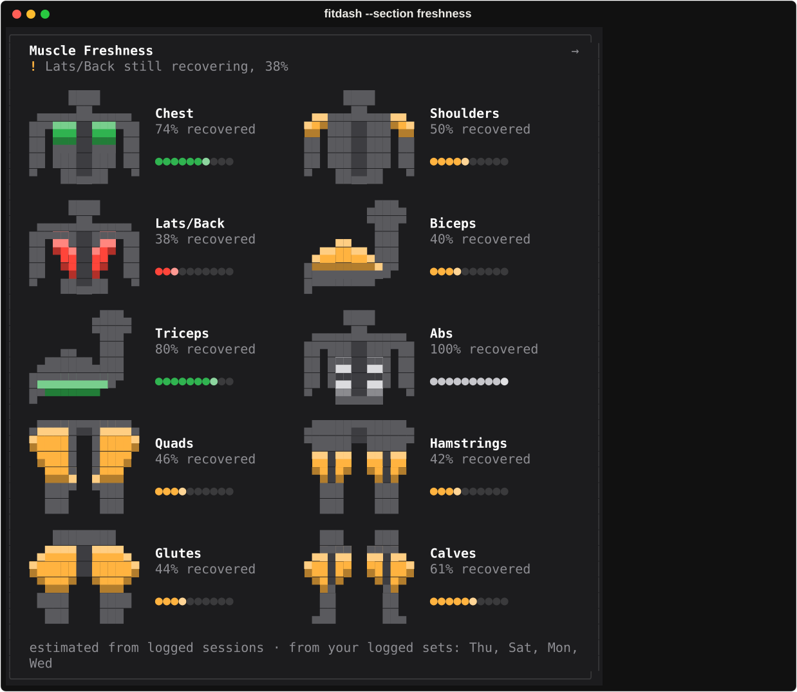
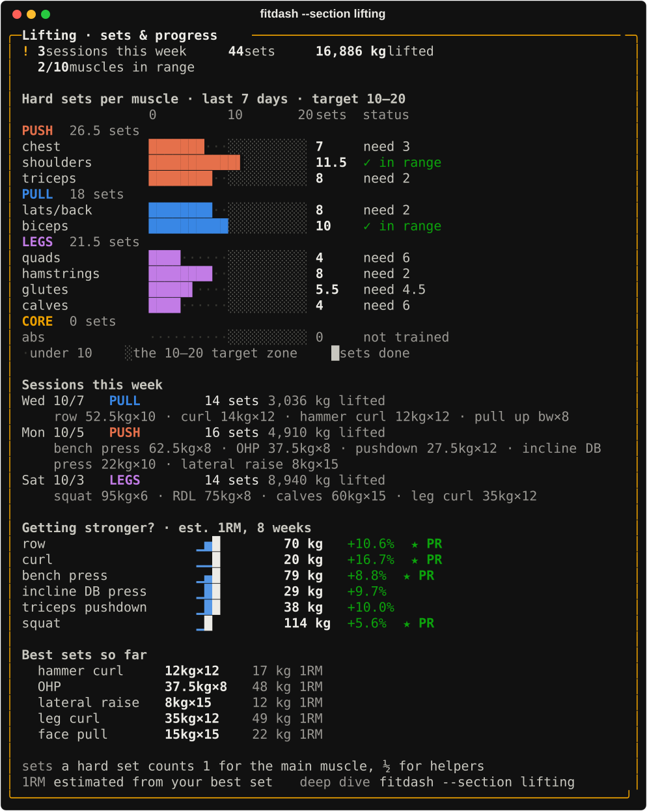
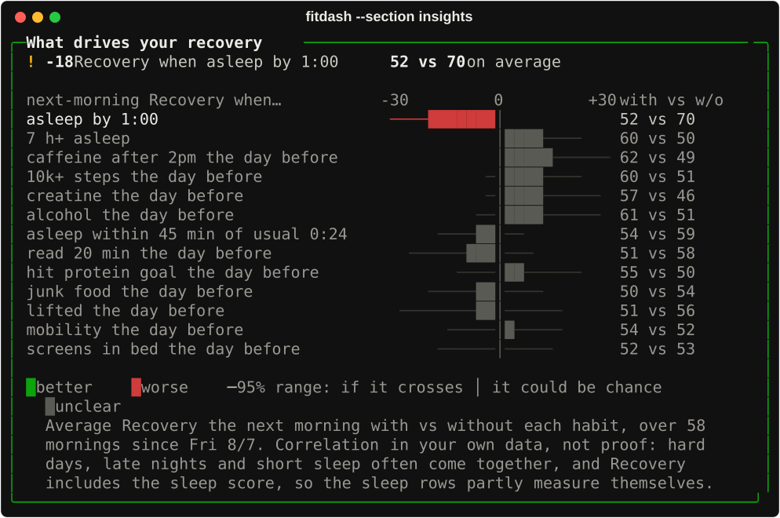
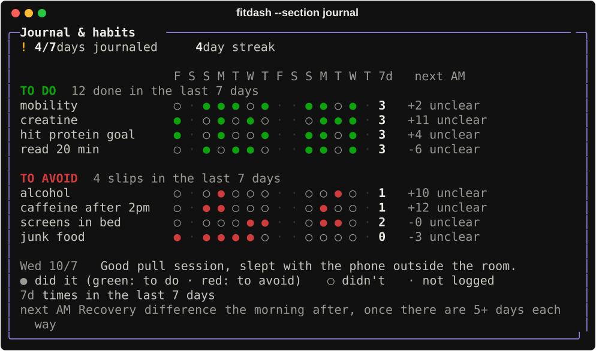
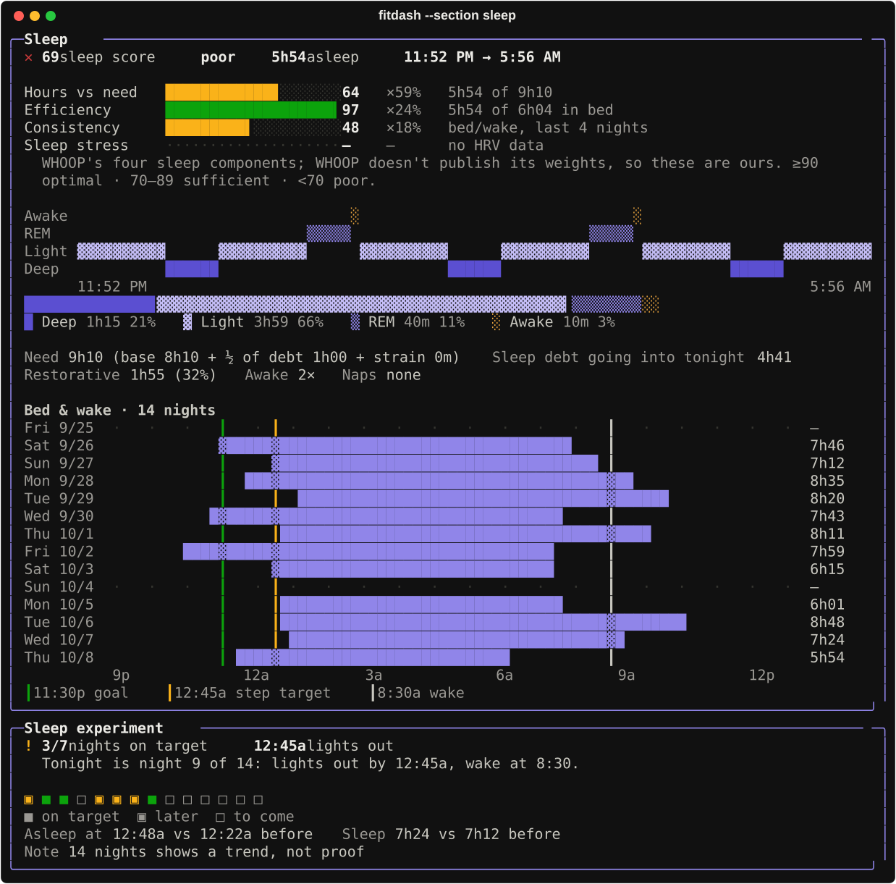
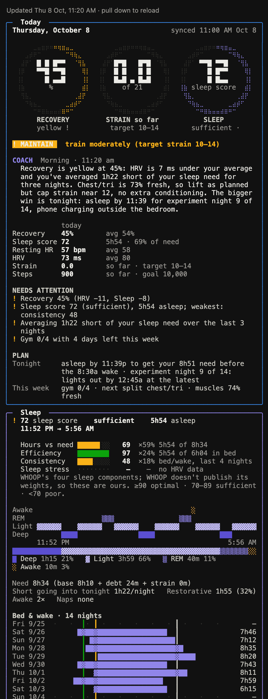

# fitbit-mcp + fitdash

**Your own Fitbit / Google Health data, on your own machine: a read-only MCP server for Claude, and
`fitdash`, a WHOOP-style terminal dashboard with recovery, strain, sleep, muscle freshness, a lift
log, habit tracking and an AI coach.**



<sub>All screenshots are generated from synthetic data by [`docs/demo/make_demos.py`](docs/demo/make_demos.py).</sub>

## What's in here

| Part | What it does |
| --- | --- |
| **[fitbit-local MCP server](docs/mcp-server.md)** | Connects your Google Health (or legacy Fitbit) account read-only, imports your full history into a local SQLite database, keeps it synced, and gives Claude 13 tools to query, summarize and export it. Also imports Google Takeout. |
| **[`fitdash`](docs/fitdash.md)** | A terminal dashboard on top of that database: Recovery %, Strain 0–21 and Sleep score rings, sleep stages and timing, HRV / resting HR trends, workouts and HR zones, training load, muscle freshness, lifting volume and progress, habits, body weight and more. |
| **[Coach, brief & phone page](docs/automation.md)** | A Claude-written coach note in the morning, after workouts and in the evening; a 9 a.m. notification; and the dashboard as a web page you can open on your phone over Tailscale. |
| **[Claude Code skills](.claude/skills)** | `/stats` (sync, show the dashboard, coach) and `daily-health-brief`, so you can just ask Claude "show me my stats" or "I did bench 3x8 at 60". |

## A quick look

| Today: rings, verdict, coach note, key numbers | Muscle freshness from your actual sets |
| --- | --- |
|  |  |
| **Lifting: sets per muscle vs 10–20 / week, 1RM progress** | **What drives *your* recovery** |
|  |  |
| **Journal & habits, linked to next-morning recovery** | **Sleep score, stages and 14 nights of timing** |
|  |  |

<details><summary>On a phone (Safari, over Tailscale)</summary>



</details>

## Quick start

You need macOS or Linux, [uv](https://docs.astral.sh/uv/) and data access through **one** of: an
approved Google Health API project (or the `ghealth` CLI), a working legacy Fitbit app, or a
Google Takeout export. [Which one can I use?](docs/mcp-server.md#1-which-route-can-you-use)

```sh
git clone https://github.com/pranshavpatel/fitbit-mcp.git && cd fitbit-mcp
uv sync                              # the MCP server's environment
sh bin/install-fitdash.sh            # puts `fitdash` in ~/.local/bin
claude                               # approve the "fitbit-local" server when asked
```

Then, in Claude Code:

1. "Connect my Google Health account", then "Import all my history". Claude reports success only
   once the import job has actually finished.
2. "Show me my stats", or run `fitdash` in any terminal. It syncs first if the data is over 30 min old.

Want to see it without an account? `uv run --script docs/demo/make_demos.py` builds a synthetic
data home and renders every view.

The step-by-step version, with settings and troubleshooting, is in
**[docs/getting-started.md](docs/getting-started.md)**.

## Everyday use

```sh
fitdash                                    # everything: Today box, then every area in its own box
fitdash --section freshness                # one area (sleep, recovery, insights, journal, lifting, …)
fitdash --period week                      # this week vs last
fitdash lift bench 3x8@60 row 4x10@50      # log sets (kg; 25lb for pounds; no @ = bodyweight)
fitdash journal +mobility -junk-food note "slept well"
fitdash coach run                          # a Claude-written note if one is due
fitdash brief --install                    # a notification every morning
fitdash web --install                      # the dashboard as a phone-friendly page
```

Full reference: [docs/fitdash.md](docs/fitdash.md).

## How the numbers work

Recovery, Strain and Sleep score use WHOOP-like scales, calibrated on **your** history. They are
not WHOOP's proprietary algorithm. Every formula is plain Python in
[`scores.py`](.claude/skills/stats/scripts/scores.py) and documented in
[docs/scores.md](docs/scores.md). In short:

- **Recovery 0–100 %**: overnight HRV (45 %), resting HR (30 %) and sleep score (25 %) as z-scores
  against your previous 28 days, through a logistic curve.
- **Strain 0–21**: Banister TRIMP from heart-rate zones calibrated to your own Fitbit zones, on a
  log scale.
- **Sleep score**: hours vs need (50 %), efficiency (20 %), consistency (15 %), sleep stress (15 %).
- **Muscle freshness**: a fatigue model with per-muscle half-lives, fed by your logged sets.
- **Insights**: next-morning recovery with vs without each habit (Welch's t). Correlation, not proof.

## Design principles

- **Local first.** Data lives in `~/.fitbit-mcp`. The server only ever makes read-only (GET and
  read-only query) calls to Google/Fitbit, with `.readonly` scopes.
- **Honest numbers.** Missing days are gaps, not zeros. A score with no inputs shows "—", never a
  guess. Low-wear days don't count as rest days.
- **No free-form SQL.** Every query is parameterized, and the tools expose fixed operations only.
- **Not medical advice.** These are estimates for training and habits. Talk to a clinician about
  anything that worries you.

## Project layout

```text
src/fitbit_mcp/          the MCP server (OAuth, importer, jobs, store, queries, summaries, Takeout)
tests/                   server tests (synthetic fakes of the Google/Fitbit APIs)
.claude/skills/stats/    fitdash: scripts/ (dashboard, scores, data, charts, coach, …) and tests/
.claude/skills/daily-health-brief/   a lighter one-screen brief
docs/                    guides, plus demo/ (screenshots and the script that makes them)
bin/install-fitdash.sh   installs the `fitdash` command
```

More in [docs/architecture.md](docs/architecture.md), including how to add a metric or a section.

## Contributing

Issues and pull requests are welcome. See [CONTRIBUTING.md](CONTRIBUTING.md). Both test suites
run offline on synthetic data:

```sh
uv run pytest                                                                         # server: 76 tests
uv run --no-project --with rich --with pytest pytest .claude/skills/stats/tests       # fitdash: 312 tests
```

## License

[MIT](LICENSE). Fitbit and Google Health are trademarks of Google. WHOOP is a trademark of WHOOP,
Inc. This project isn't affiliated with any of them.
