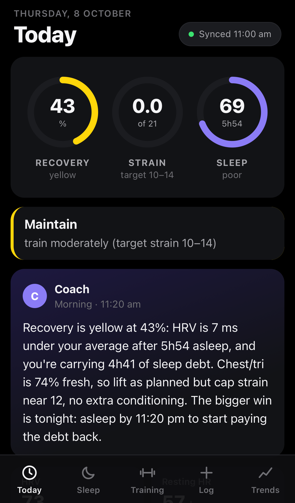
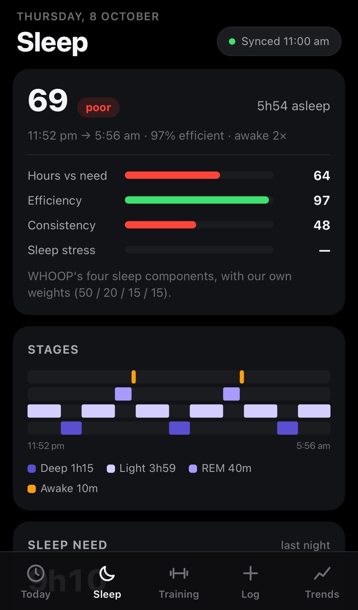
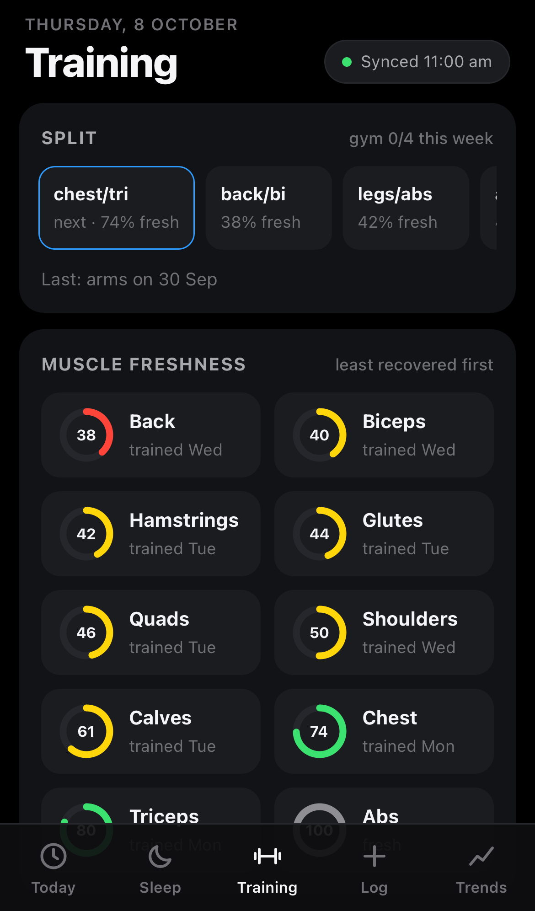
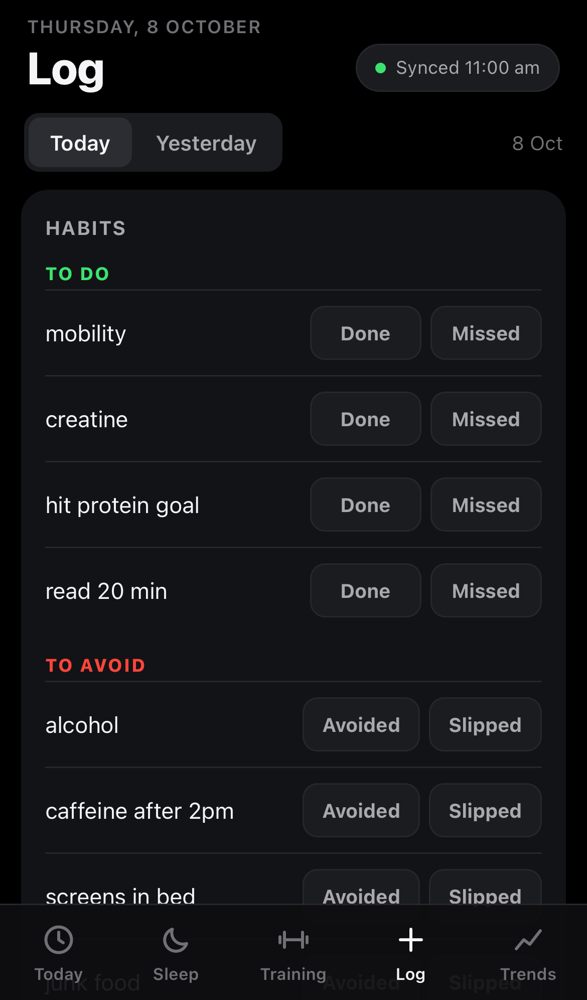
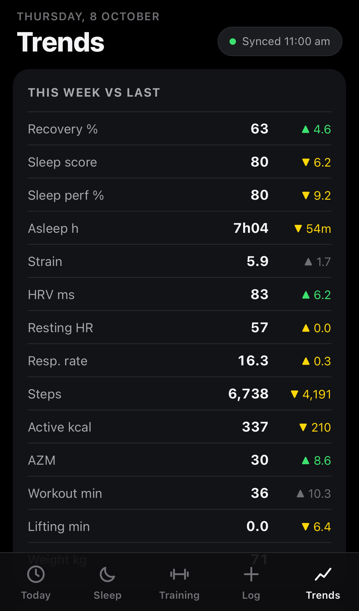

# Phone app, coach notes and morning brief

Optional background jobs. On macOS each is a per-user `launchd` agent in
`~/Library/LaunchAgents/com.fitdash.*.plist`, installed and removed with one command, with logs in
`~/.fitbit-mcp/*.log`. On Linux, run the same commands from cron or a systemd timer.

## Coach notes

The Today box shows a **COACH** note under the verdict, written in the style of a WHOOP coach:


```sh
fitdash coach --install                         # check every 30 min for a due note
fitdash coach run                               # write one now if due
fitdash coach run --kind evening --force        # write one now regardless
fitdash coach run --kind morning --dry-run      # print what would be sent and the reply; save nothing
fitdash coach set note "Deload week."           # your own note
fitdash coach show
```

**When a note is due**

| Note | When |
| --- | --- |
| morning | 05:00–12:00, once last night's sleep has synced (or from 10:30), once a day |
| activity | a workout of 10+ min that ended in the last 4 h, unless a later note already covered it |
| evening | from 21:00, or 90 min before tonight's asleep-by time if that's earlier, but not before 20:00. Until 04:00 it still counts as the previous day. |

**How it's written.** `coach.py` builds a summary of the numbers: Recovery and its drivers,
last night's sleep, strain vs target, today's and this week's workouts, the last 7 days of every
key metric, training load, lifting volume and progress, body weight and nutrition, the journal,
your personal recovery patterns, notes already written today, and `coaching/profile.md`. It sends
that to the `claude` CLI in print mode **with no tools, no MCP servers and no saved session**:

```sh
claude -p --tools "" --strict-mcp-config --no-session-persistence --system-prompt "<coach rules>"
```

Claude only returns text: at most ~75 words, leading with what matters, with 1–2 concrete actions.
It won't suggest running or jumping during an impact spike, and points you to a clinician for
anything worrying. The note goes to `coaching/notes.json`. If the CLI is missing or fails, the box
shows a rule-based note marked "auto".

The summary goes to Anthropic each time, like anything you ask Claude. Leave out sections in
`coach.context()` if you'd rather not share them.

## Morning brief

```sh
fitdash brief --install          # daily, 30 min after wake_anchor (or "brief_time" in stats.json)
fitdash brief --install 07:45
fitdash brief                    # now: sync, write the morning coach note if due, notify
fitdash brief --print            # print instead of notifying
fitdash brief --status | --uninstall
```

The notification shows *Recovery · Sleep score · hours asleep* as the title. The body is the
morning coach note when there is one; otherwise it's the strain target, the next split day and
its freshness, tonight's asleep-by time, and muscles under 10 sets. A Mac that was asleep at the
scheduled time runs the brief when it wakes. macOS may ask you to allow notifications from Script
Editor the first time.

## Phone app

```sh
fitdash web --install            # run the app on 127.0.0.1:8787 in the background (+ keep /terminal fresh)
fitdash app                      # or run it in the foreground
fitdash web --status | --uninstall
```

| Today | Sleep | Training | Log | Trends |
| --- | --- | --- | --- | --- |
|  |  |  |  |  |

- **Today**: Recovery, Strain and Sleep rings, the verdict, the coach note, HRV, resting HR,
  sleep and steps with 14-day trends, *Needs attention* and tonight's plan.
- **Sleep**: score and its four parts, stages, need and debt, 14 nights of bed & wake times, and
  the sleep experiment.
- **Training**: split queue, muscle freshness (least recovered first), hard sets per muscle vs
  10–20, 1RM progress, the last 7 days of workouts, training load and impact minutes.
- **Log**: journal habits as *Done / Missed* and *Avoided / Slipped* buttons (tap again to clear),
  a note, and a lift box that takes the same text as `fitdash lift` (`bench 3x8@60 row 4x10@50`),
  with recent exercises as chips and an undo. Today or yesterday.
- **Trends**: this week vs last, 28 days of recovery, HRV and resting HR against your normal
  range, strain, sleep, what drives your recovery, and weight.

The **Sync** pill at the top starts a Google sync. The app also refreshes whenever you open it or
switch tabs after logging. The old terminal-style page is still at `/terminal`.

**How it works.** `appserver.py` is a small standard-library HTTP server. It serves the app (plain
HTML/CSS/JS in `.claude/skills/stats/app`, no build step and no external requests), the model as
JSON (`/api/model`, the same numbers as `fitdash --json`), and a few write endpoints for the
journal and lift log. It listens on **127.0.0.1 only**. Writes require a JSON body and an
`X-Fitdash` header, which another website open on your phone can't send without a CORS preflight
that the server never approves. A strict Content-Security-Policy blocks inline scripts. Only your
own logs in `~/.fitbit-mcp` are ever written; the Fitbit database is opened read-only.

**Opening it on your phone** with [Tailscale](https://tailscale.com) (free for personal use):

1. Install Tailscale on the computer and the phone, signed in to the same account.
2. `tailscale serve --bg 8787`. The first time, it gives you a link to enable Serve on your tailnet.
3. Open `https://<computer-name>.<tailnet>.ts.net` in Safari and choose *Share → Add to Home
   Screen*. It opens full-screen like an app.

`tailscale serve` shares it with your own devices only. `tailscale funnel 8787` would make it
public, and that includes the logging endpoints, so anyone with the link could see your data and
write to your journal. Don't do that unless you add your own authentication in front of it.

The computer has to be awake for the app to load. On macOS, `sudo pmset -a womp 1` lets it wake
for network access.

## Removing everything

```sh
fitdash coach --uninstall && fitdash brief --uninstall && fitdash web --uninstall
tailscale serve reset            # if you set it up
```

Your data in `~/.fitbit-mcp` is left alone. Delete that folder to remove it.
