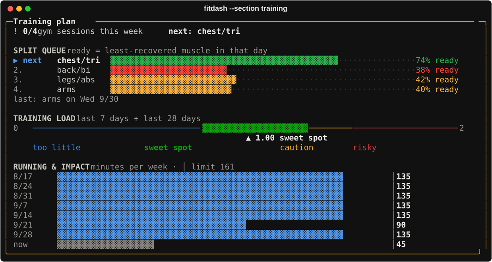

# fitdash reference

`fitdash` draws your data from `~/.fitbit-mcp/fitbit.sqlite3` (opened read-only) as a terminal
dashboard. In an interactive terminal it first syncs through the MCP server's own code if the last
sync is over 30 minutes old (`FITDASH_SYNC_MAX_AGE`).

Install it with `sh bin/install-fitdash.sh`, or run it directly:
`uv run --script .claude/skills/stats/scripts/dashboard.py`.

## The dashboard

```sh
fitdash                         # Today box, then every area in its own box
fitdash --width 120 --no-color  # fixed width, plain text (for pasting)
fitdash --date 2026-10-01       # a past day
fitdash --days 42               # longer trend charts (14–90)
fitdash --period week|month     # averages vs the previous week / month
fitdash --json                  # the computed model: every number the boxes show
fitdash --sync / --no-sync      # always / never sync first
```

From 140 columns, the boxes sit in two columns: recovery on the left, training on the right.
Below that it's one column, at most 100 wide.

### Sections (`--section NAME`)

On its own, a section shows its normal box plus an **extended view**: 8 weeks of history instead of 4, and
extra boxes you don't get in the full dashboard:

| Section | Extended view adds |
| --- | --- |
| `sleep` | Hours vs need and sleep score for every night, stages night by night, timing stats (average bed and wake time, spread, weekend vs weekday), sleep-debt balance over 28 nights, best and worst nights |
| `recovery` | A recovery calendar (weeks × days), recovery vs the previous day's strain as a scatter plot |
| `strain` | Activity by hour for 7 days (heatmap), HR zones per day for 14 days, weekly totals for 8 weeks |
| `workouts` | An 8-week workout calendar, totals per activity type |
| `freshness` | *Ready when*: when each muscle is back to 90 % |
| `lifting` | Hard sets per muscle for 6 weeks (heat table), 1RM progress chart per lift |
| `training` | Weekly totals and *Ready when* |
| `journal` | 30-day rate, current and best streak per habit |
| `insights` | Every morning as a dot, with vs without each habit |


| Section | Shows |
| --- | --- |
| `today` | Rings (Recovery, Strain, Sleep), the verdict, the coach note, key numbers with 14-day trends, *Needs attention* and *Plan* |
| `sleep` | Sleep score and its four parts, stage timeline, need and debt, 14 nights of bed & wake times, plus the sleep experiment |
| `recovery` | What moved today's Recovery, HRV and resting-HR trends, respiration, SpO₂, skin temperature, VO₂ max |
| `insights` | What drives *your* recovery: habits vs next-morning Recovery |
| `journal` | Habit grid for 14 days (to do / to avoid), streak, latest note |
| `freshness` | Muscle cards with pixel icons (`--sort freshness` puts the least recovered first) |
| `lifting` | Hard sets per muscle vs 10–20/week, per-lift 1RM progress and PRs |
| `training` | Split queue, gym days this week, load ratio, running/impact minutes per week |
| `workouts` | Last 7 days, one row per day with zone bars, key sessions, records |
| `strain` | Strain vs target, 28-day strain, steps and activity by hour |
| `week` | This week vs last for 10 metrics |
| `body` | Weight vs lean-bulk corridor, calories and macros |
| `logs` | Symptom/mood logs status |



## Logging

### Lifts

```sh
fitdash lift bench 3x8@60 row 4x10@50              # today
fitdash lift yesterday squat 5x5@100 rdl 3x8@80     # or a YYYY-MM-DD date
fitdash lift incline db press 1x12@40lb 2x10@45lb   # one group per weight; lb is converted
fitdash lift pullups 3x8 dips 3x12                  # no @ = bodyweight
fitdash lift                                        # show today's log
fitdash lift undo                                   # remove today's last entry
```

Exercise names are matched loosely: aliases (`ohp`, `rdl`, `pulldown`), plurals, and equipment
prefixes (`cable`, `machine`, `db`). Each exercise maps to primary and secondary muscles in
`scores.EXERCISES`. Add yours there.

### Split tags

If you don't log sets, tell fitdash what a Fitbit strength session trained:

```sh
fitdash tag yesterday pull
```

Untagged lifts after `split_anchor` follow your split rotation and are marked "assumed".

### Journal & habits

```sh
fitdash journal                                   # asks each habit (y / n / Enter to skip), then a note
fitdash journal +mobility -junk-food note "hot room, slept badly"
fitdash journal yesterday -alcohol                # before noon the default day is already yesterday
fitdash journal show
fitdash journal habits                            # the list and keys
```

`+` = did it, `-` = didn't, and the start of a key is enough. Define habits in `stats.json`
(`good: true` to do, `false` to avoid, `null` to just track).

### Priorities

```sh
fitdash priorities                                 # set (morning) or review (evening)
fitdash priorities set "…" "…" "…"                 # today's top 3
fitdash priorities done 1 | some 2 | missed 3      # how each one went
```

`fitdash` asks for them on its own in the morning and evening. See
[automation.md](automation.md#daily-priorities).

## Automation

| Command | What it does |
| --- | --- |
| `fitdash coach run` | Writes a Claude coach note if one is due (`--kind`, `--force`, `--dry-run`) |
| `fitdash coach set <kind> "text"` / `show` | Save your own note / list today's |
| `fitdash coach --install` | Check every 30 min for a due note (launchd) |
| `fitdash brief [--print]` | Sync, then a macOS notification with today's call |
| `fitdash brief --install [HH:MM]` | Run the brief every morning |
| `fitdash app [--port 8787]` | Serve the phone app on 127.0.0.1 (view everything, log habits and lifts) |
| `fitdash web --install` | Run the phone app in the background and keep the terminal-style page (`/terminal`) fresh |
| `fitdash --html [PATH]` | Write the terminal-style dashboard as one HTML page |

All `--install` commands have `--uninstall`, and `brief` and `web` also have `--status`. Details:
[automation.md](automation.md).

## Environment variables

| Variable | Default | Meaning |
| --- | --- | --- |
| `FITBIT_MCP_HOME` | `~/.fitbit-mcp` | Data home |
| `FITDASH_TZ` | your computer's zone | Display timezone (or `"timezone"` in stats.json) |
| `FITDASH_SYNC_MAX_AGE` | `30` | Minutes before an interactive run syncs |
| `NO_COLOR` | unset | Plain output |
